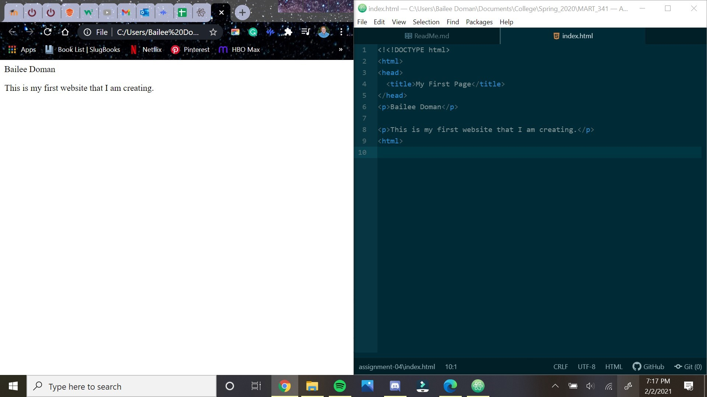

1. Browsers function by requesting access to different parts of the internet by displaying and interpreting HTML and CSS files.

2. Markup language is used to annotate documents on the computers in human English.

