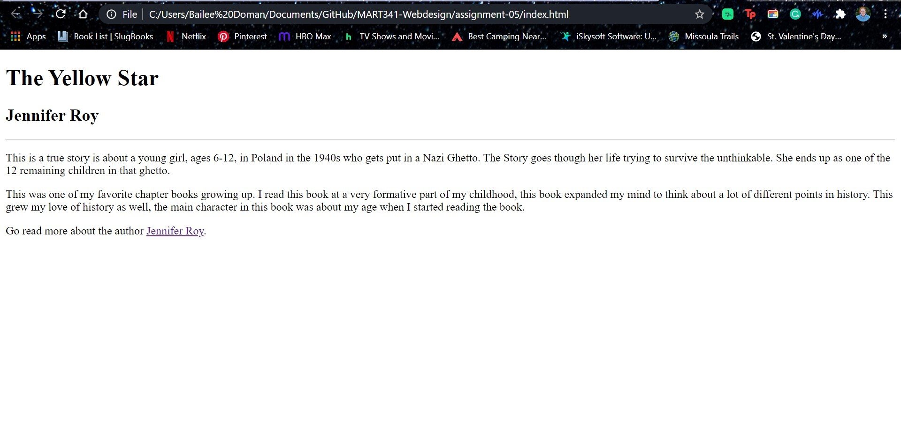
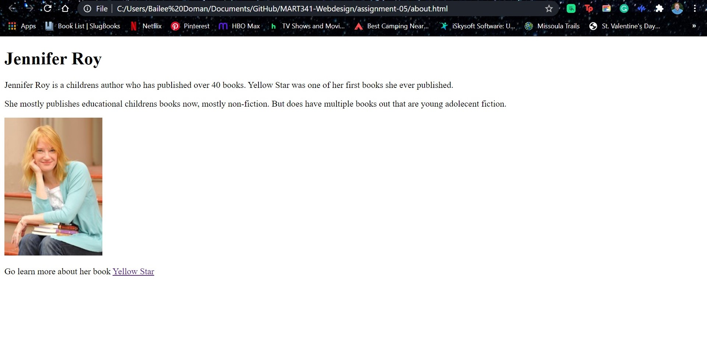

1. I went to the University of Montana website, it was very interesting to see how it has changed since the 1990s. It looked very boxy, not a lot of different and interesting fonts. There was not a lot going on the website. Now there is a lot more hyperlinks and a lot more information on the website.

2. This homework was a little challenging. I felt like the directions felt a little confusing to me. It seemed like a lot of back and forth and some of the directions felt a little lacking in clarity. Like trying to link my about.htlm page to my index.htlm page. As well as the "Add your story here" direction. I used a chapter book and was not really sure what that direction was trying to get me to do. I did ask those questions and got those cleared up though.

3.

